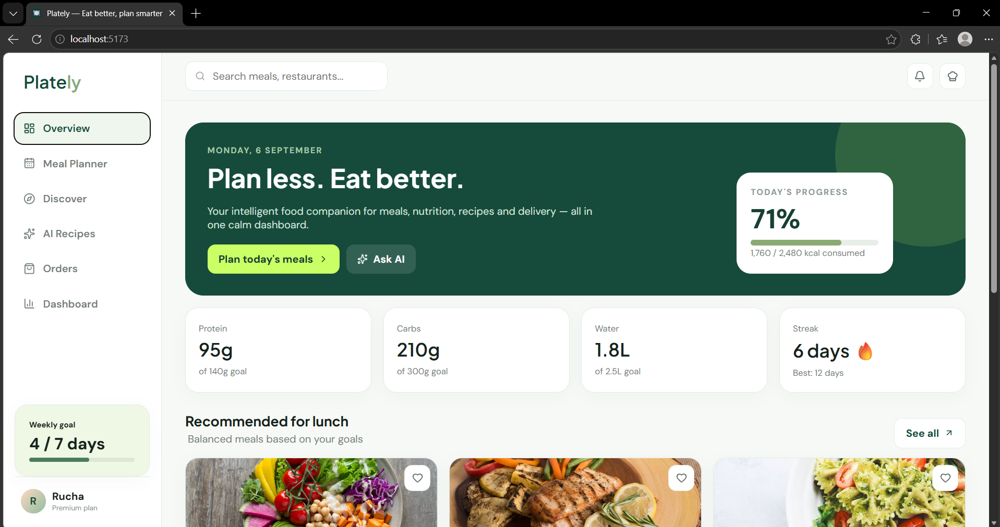
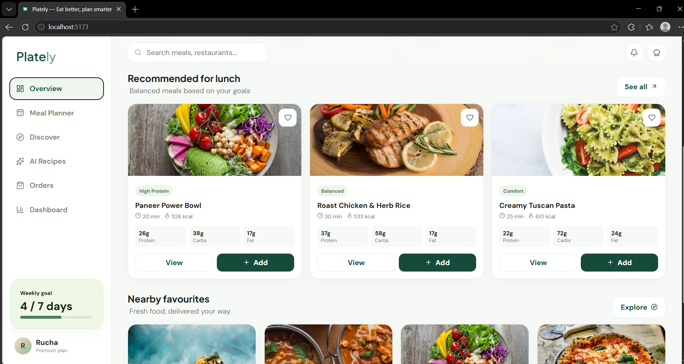
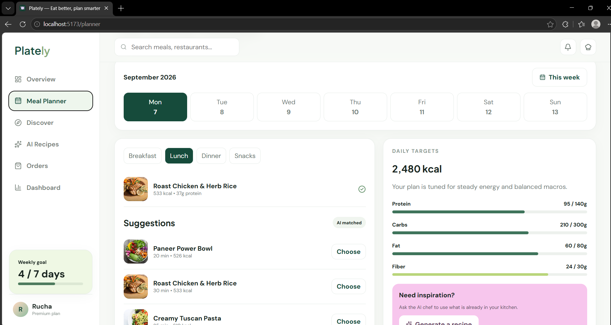
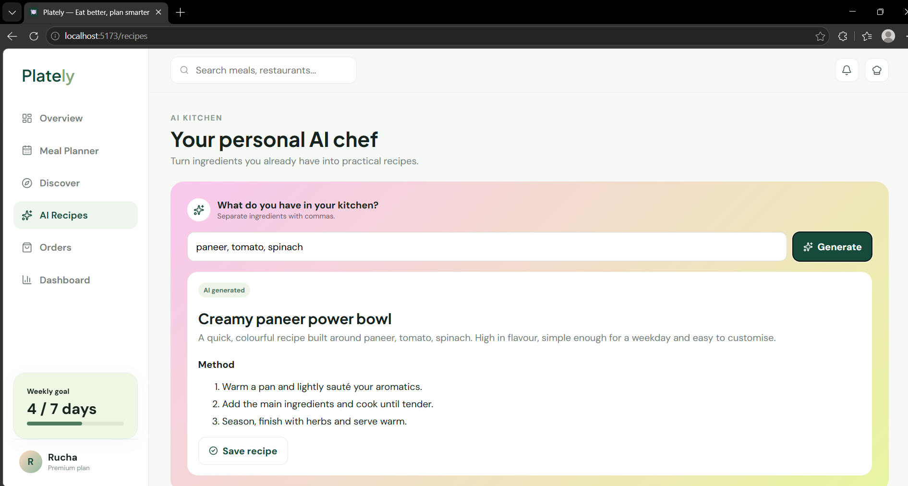
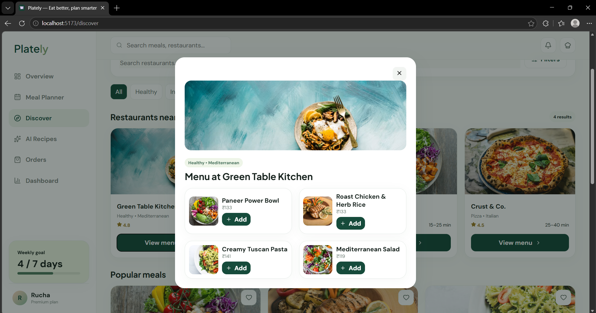
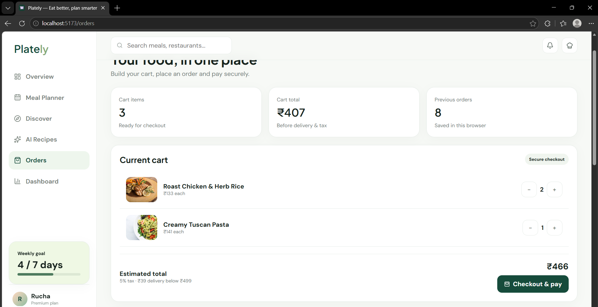
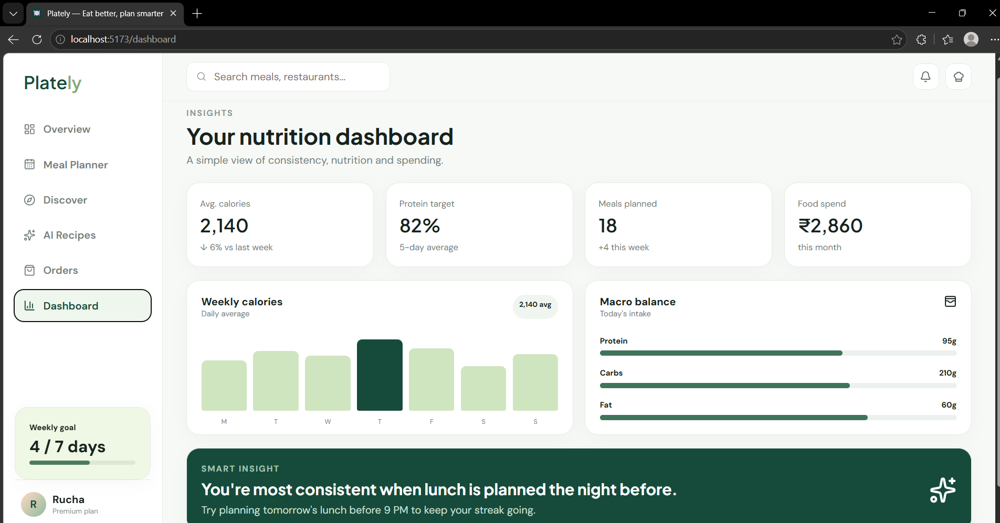

# 🍽️ Plately — Eat Better, Plan Smarter

### Smart Food, Meal Planning & Nutrition Management Platform

Plately is a modern food and nutrition management platform designed to help users plan meals, discover food, generate AI-powered recipes, manage orders, and monitor their nutrition through a personalized dashboard.

The application combines **meal planning, nutrition tracking, AI-assisted recipe generation, restaurant discovery, food ordering, and analytics** into one simple and user-friendly platform.

---

## ✨ Features

* 🎨 Modern and professional UI/UX
* 📱 Responsive design
* 🥗 Personalized meal planning
* 🍱 Breakfast, lunch, dinner and snack planning
* 🤖 AI-powered recipe generation
* 🧠 Ingredient-based recipe suggestions
* 🔎 Restaurant and food discovery
* 🍽️ Recommended meals
* ❤️ Favourite meal support
* 🛒 Shopping cart and order management
* 💳 Checkout and payment interface
* 📊 Nutrition dashboard
* 📈 Calorie and macro tracking
* 💪 Protein, carbohydrate and fat tracking
* 💧 Water intake tracking
* 🔥 Daily streak tracking
* 📅 Weekly meal goals
* ⚡ Fast and interactive frontend
* 🖥️ Node.js backend
* 💾 JSON-based data storage

---

# 🖥️ Project Screenshots

## 🏠 Plately Overview Dashboard



The overview page provides a quick summary of the user's meals, calories, nutrition progress, weekly goals, recommended meals and food preferences.

---

## 🍽️ Recommended Meals



Users can explore recommended meals along with nutritional information such as calories, protein, carbohydrates, fat and preparation time.

---

## 📅 Meal Planner



The Meal Planner allows users to organize meals according to different days and meal types such as breakfast, lunch, dinner and snacks.

---

## 🤖 AI Recipe Generator



Users can enter ingredients available in their kitchen and generate personalized recipe suggestions.

---

## 🔎 Restaurant & Food Discovery



The Discover section allows users to explore restaurants, food categories and available food items.

---

## 🛒 Orders & Cart



The Orders section allows users to manage cart items, change quantities, view previous orders and proceed through the checkout process.

---

## 📊 Nutrition Dashboard



The nutrition dashboard provides insights into calories, protein targets, planned meals, food spending and nutrition trends.

---

# 🧠 How It Works

```text
                    👤 User
                      │
                      ↓
              🏠 Plately Dashboard
                      │
        ┌─────────────┼─────────────┐
        ↓             ↓             ↓
   🍱 Meal Planner  🔎 Discover  🤖 AI Recipes
        │             │             │
        ↓             ↓             ↓
   Meal Selection  Restaurant    Ingredient
        │             Menu        Analysis
        │             │             │
        └─────────────┼─────────────┘
                      ↓
                  🛒 Cart
                      ↓
                💳 Checkout
                      ↓
                 📦 Orders
                      │
                      ↓
              📊 Nutrition Data
                      │
                      ↓
             📈 User Dashboard
```

---

# 📖 Theory

Plately is a full-stack food and nutrition management application developed to provide users with an integrated platform for meal planning, food discovery and nutrition monitoring.

The system allows users to create meal plans, explore recommended food items, generate recipes from available ingredients, discover restaurants and manage food orders.

The application also provides nutrition-related information such as calories, protein, carbohydrates, fat, water intake and weekly goals. These values are presented through an interactive dashboard to help users understand their food and nutrition patterns.

The project demonstrates concepts of:

* 🌐 Full-stack web development
* ⚛️ React.js
* 🟢 Node.js
* 🔌 REST API integration
* 📊 Data visualization
* 🤖 AI-assisted applications
* 🛒 E-commerce functionality
* 📱 Responsive UI/UX design
* 💾 Data management

---

# 🛠️ Tech Stack

## 🎨 Frontend

* React.js
* Vite
* JavaScript
* HTML5
* CSS3
* Lucide React Icons
* Recharts

## ⚙️ Backend

* Node.js
* Express.js
* REST API
* JSON-based data storage

## 📊 Data Visualization

* Recharts
* Interactive nutrition charts
* Progress indicators
* Macro tracking

## 🔧 Development Tools

* Git
* GitHub
* npm
* Visual Studio Code

---

# 📋 Requirements

Before running the project, make sure the following software is installed:

* 🟢 Node.js
* 📦 npm
* 🌐 Modern web browser
* 💻 Git

Check Node.js:

```bash
node --version
```

Check npm:

```bash
npm --version
```

Check Git:

```bash
git --version
```

---

# ▶️ Installation & Setup

## 1️⃣ Clone the Repository

Clone the project from GitHub:

```bash
git clone https://github.com/ruchakothari2011/Plately.git
```

Move into the project directory:

```bash
cd Plately
```

---

## 2️⃣ Install Frontend Dependencies

Install all required frontend packages:

```bash
npm install
```

---

## 3️⃣ Start the Frontend

Run the frontend development server:

```bash
npm run dev
```

After starting the development server, the terminal will display a local URL.

Usually:

```text
http://localhost:5173
```

Open the URL in your web browser.

---

# ⚙️ Backend Setup

The backend is available inside the `backend` folder.

Open a **new CMD/Terminal window** while keeping the frontend running.

Navigate to the backend:

```bash
cd backend
```

Install backend dependencies:

```bash
npm install
```

Start the backend:

```bash
npm start
```

If the development script is configured, you can also run:

```bash
npm run dev
```

The backend normally runs on:

```text
http://localhost:5000
```

---

# 🔗 Running Frontend & Backend Together

You need **two terminals** to run the complete application.

### 🖥️ Terminal 1 — Frontend

```bash
cd Plately
npm install
npm run dev
```

### ⚙️ Terminal 2 — Backend

```bash
cd Plately/backend
npm install
npm start
```

Keep both terminals running while using the application.

---

# 📁 Project Structure

```text
Plately/
│
├── 📁 backend/
│   ├── 📁 data/
│   │   └── db.json
│   │
│   ├── 📁 src/
│   │   ├── db.js
│   │   ├── seedAdmin.js
│   │   └── server.js
│   │
│   ├── .env.example
│   ├── package.json
│   ├── package-lock.json
│   └── README.md
│
├── 📁 public/
│
├── 📁 src/
│   ├── 📁 data/
│   │   └── app.js
│   │
│   ├── 📁 lib/
│   │   └── api.js
│   │
│   ├── App.jsx
│   ├── index.css
│   └── main.jsx
│
├── 📁 screenshots/
│   ├── 01-overview-top.png
│   ├── 02-overview-meals.png
│   ├── 03-meal-planner.png
│   ├── 04-ai-recipes.png
│   ├── 05-discover.png
│   ├── 06-orders.png
│   └── 07-dashboard.png
│
├── 📄 .env.example
├── 📄 .gitignore
├── 📄 index.html
├── 📄 package.json
├── 📄 package-lock.json
└── 📄 README.md
```
